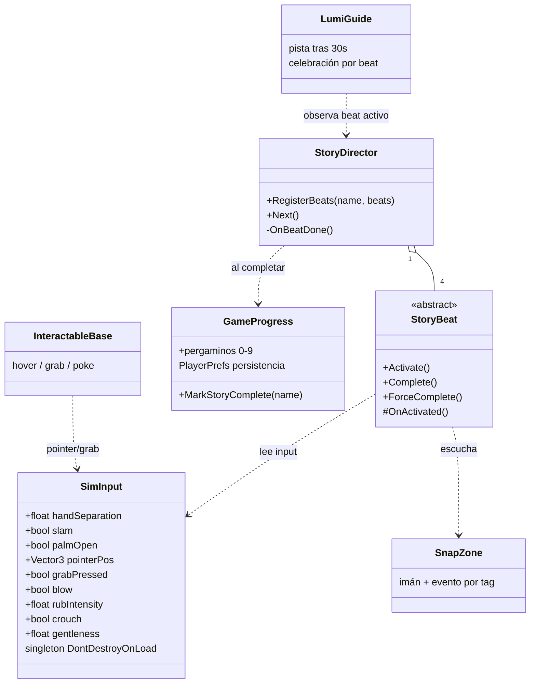
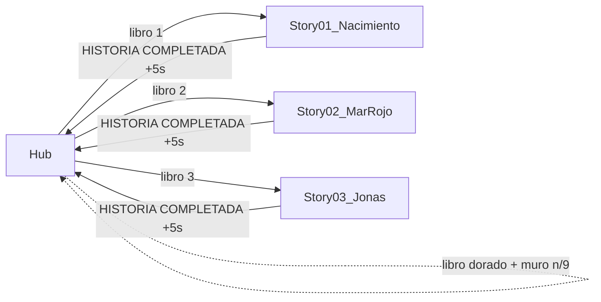

# FASE 1 — Cierre y validación · "El Gran Libro: Aventuras de la Biblia VR"

**Fecha de validación:** 21-jul-2026 · Editor: Unity 6.4 (6000.4.6f1) · Proyecto: `test_mcp_unity`

## 1. Resultado de la validación final (telemetría real de consola)

- **Hub:** carga las 3 historias, libros dorados al completarse, muro de versículos funcional (8/9 pergaminos al momento de la prueba).
- **Story01 Nacimiento:** ✅ completada y persistida (`GameProgress`). Ya usa modelos reales (`SM_Lumi.glb`, paloma, camello, María/José) — pipeline de assets probado.
- **Story02 Mar Rojo:** ✅ completada y persistida. Apertura proporcional heredada de la PoC.
- **Story03 Jonás:** ✅ validada por QA-skip (K): secuencia BEAT 1→2→3→4 → "HISTORIA COMPLETADA" → guardado → retorno automático al Hub → libro dorado. **0 errores en consola.**
- **Persistencia:** `PlayerPrefs` conserva historias completadas y pergaminos entre sesiones (verificado: arrancó con 2 historias OK y 5/9, terminó 3 OK y 8/9).

## 2. Checklist de criterios de éxito (guía §8.4)

- [x] Hub carga las 3 historias y refleja progreso.
- [x] Nacimiento: 4/4 beats (validado en playthrough previo).
- [x] Mar Rojo: apertura proporcional + cruce + cierre con slam (validado en playthrough previo).
- [x] Jonás: secuencia 4/4 con transiciones de confort (validado por QA-skip; **pendiente playthrough manual del usuario** para sensación de cada mecánica).
- [ ] 9/9 pergaminos — falta 1 (los saltos QA no coleccionan; recolectar en playthrough manual).
- [ ] Lumi da pista a los 30 s en todos los beats (verificar en playthrough manual).
- [x] 0 errores en consola.

## 3. Diagramas de arquitectura y flujo

### 3.1 Clases core

### 3.2 Flujo de escenas

### 3.3 Beats por historia

```mermaid
flowchart TD
    subgraph Nacimiento
        A1[1 Estrella: palma E + lanzar + arrastrar] --> A2[2 Establo: heno/lámpara/manta + caricias]
        A2 --> A3[3 Regalos: oro girar / incienso soplar B / mirra verter]
        A3 --> A4[4 Cuna: ESPACIO 3s + luz dorada]
    end
    subgraph MarRojo
        B1[1 Báculo: G + zona orilla] --> B2[2 Apertura: ESPACIO proporcional]
        B2 --> B3[3 Cruce: WASD + corderito + niña]
        B3 --> B4[4 Cierre: slam X + splash]
    end
    subgraph Jonas
        C1[1 Tormenta: 5 baldes + 2 cuerdas + salto] --> C2[2 Estómago: 2 mareas C + pez ×3]
        C2 --> C3[3 Lámpara: 3 piezas + frotar F + colgar]
        C3 --> C4[4 Estornudo: pluma + úvula 3s + playa + planta]
    end
```

## 4. Pendientes para cerrar Fase 1 al 100%

1. **Playthrough manual de Jonás** por el usuario (sensación de mecánicas, pistas de Lumi, confort de transiciones).
2. **Pergamino faltante** (1/9) — recolectar manualmente.
3. **Commit de git** en la carpeta del proyecto Unity (`test_mcp_unity`): `git add . && git commit -m "Fase 1 graybox completa - 3 historias validadas"`.
4. Siguiente fase (GDD §6 Fase 2): Meta XR SDK + hand tracking real sustituyendo `SimInput` (1 solo archivo), arte final por el pipeline §1 de la guía.
